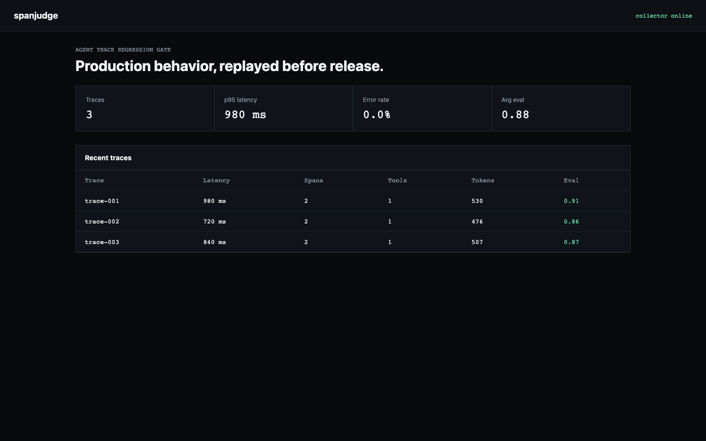

# spanjudge

**An OTLP trace collector, dashboard, and release gate for AI agents.**

Agent tests usually grade the final answer and miss the path that produced it. `spanjudge` accepts OpenTelemetry Protocol JSON traces, stores every agent and tool span in SQLite, computes latency/cost/error/evaluation metrics, and turns those metrics into a CI exit code.



## What ships

- OTLP/HTTP JSON ingestion at `POST /v1/traces`
- OpenTelemetry GenAI attributes for agent, tool, token, and evaluation telemetry
- SQLite trace storage with no external services
- Responsive browser dashboard
- JSON regression policies usable from CI
- CLI, HTTP API, Docker image, tests, and GitHub Actions matrix

## Run it end to end

```bash
python -m venv .venv && source .venv/bin/activate
python -m pip install -e .
spanjudge --database demo.db ingest demo/traces.json
spanjudge --database demo.db evaluate demo/policy.json
spanjudge --database demo.db serve
```

Open <http://127.0.0.1:4318>. The policy command exits non-zero when a release violates latency, error-rate, cost, or evaluation-score limits.

Docker is one command:

```bash
docker compose up --build
```

## API

```bash
curl -X POST http://127.0.0.1:4318/v1/traces \
  -H 'content-type: application/json' \
  --data-binary @demo/traces.json

curl http://127.0.0.1:4318/api/summary
curl http://127.0.0.1:4318/api/traces
curl -X POST http://127.0.0.1:4318/api/evaluate \
  -H 'content-type: application/json' \
  --data-binary @demo/policy.json
```

## Why this is current

OpenTelemetry's GenAI semantic conventions now define agent invocation, tool execution, token usage, latency, and evaluation telemetry. `spanjudge` implements the useful storage and release-gating layer around those attributes without pretending the still-developmental conventions are stable.

- [OpenTelemetry GenAI attribute registry](https://opentelemetry.io/docs/specs/semconv/registry/attributes/gen-ai/)
- [OpenTelemetry GenAI semantic-conventions repository](https://github.com/open-telemetry/semantic-conventions/tree/main/docs/gen-ai)

## Scope

This is an OTLP/HTTP JSON trace receiver and evaluation workbench, not a full OpenTelemetry Collector distribution. Content-bearing attributes may contain sensitive data; production deployments should apply redaction, authentication, retention, and transport security before ingestion.

## Test

```bash
python -m unittest discover -s tests -v
```

MIT licensed.
